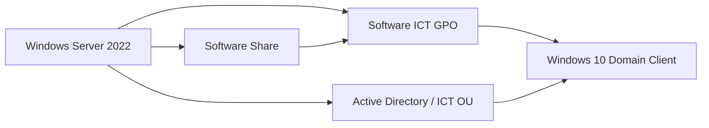
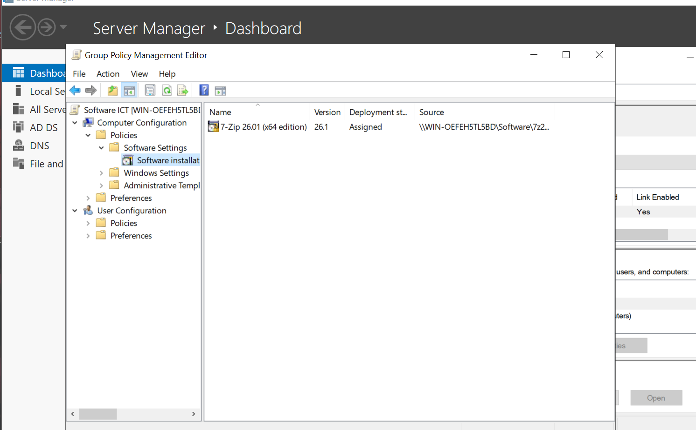
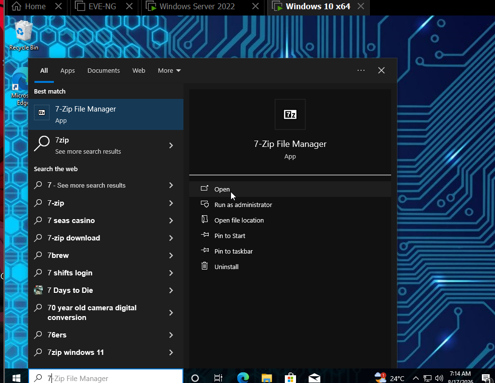
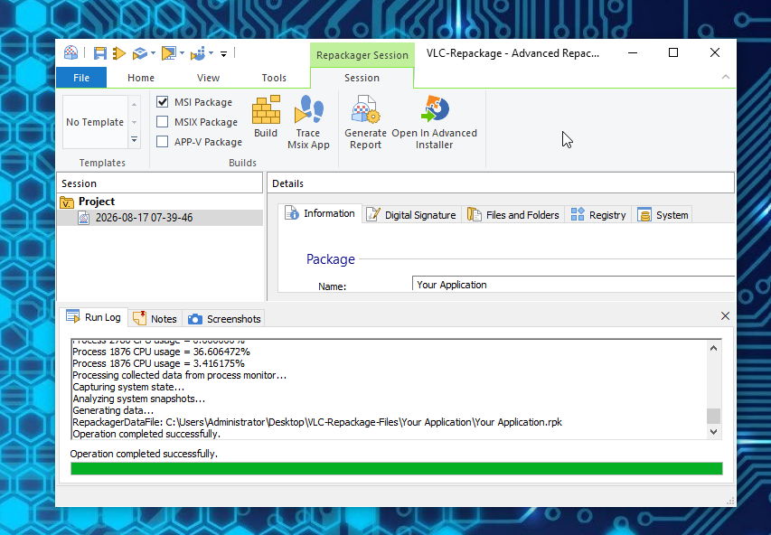
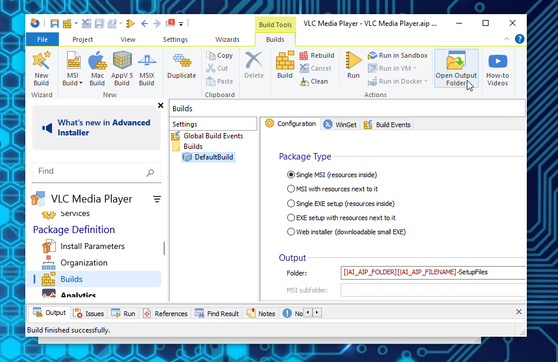
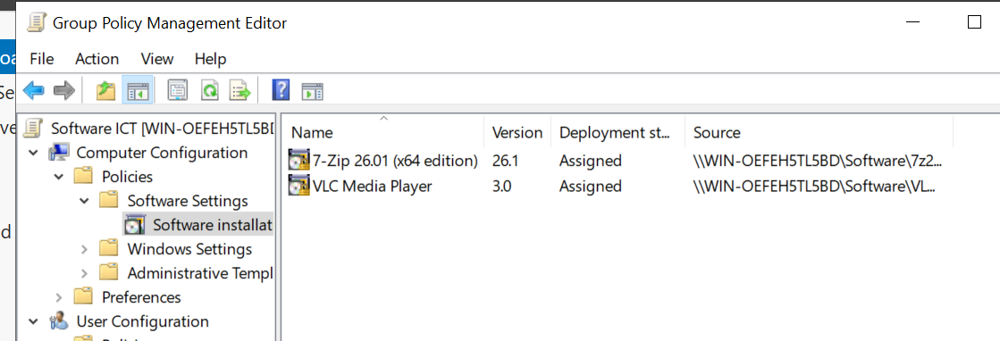
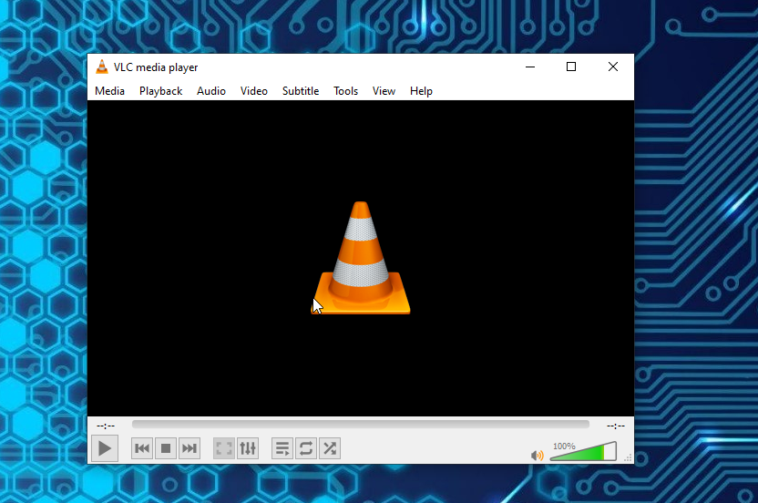

# EXE-to-MSI GPO Deployment

A Windows Server lab demonstrating **centralized application deployment with Active Directory Group Policy** in two stages:

1. Deploying a vendor-provided **MSI package (7-Zip)** through Group Policy.
2. Repackaging a vendor **EXE installer (VLC)** into an MSI with Advanced Installer, then deploying the resulting MSI through the same GPO workflow.

The final result was successful automatic installation of both applications on a domain-joined Windows 10 client after Group Policy processing and restart.

## Lab Environment

| Component | Role |
|---|---|
| Windows Server 2022 | AD DS, Group Policy Management, software distribution share |
| Windows 10 x64 | Domain-joined test client and temporary packaging VM |
| Active Directory domain | `thanfundraiser.local` |
| Target OU | `ICT` |
| Deployment GPO | `Software ICT` |
| Software share | `\\WIN-OEFEH5TL5BD\Software` |
| Native MSI example | 7-Zip 26.01 x64 |
| EXE repackaging example | VLC Media Player 3.0.23 Win32 |
| Packaging tool | Advanced Installer 23.9 Repackager |
| Hypervisor | VMware Workstation |

## Architecture



For the EXE workflow:


## Part 1 — Native MSI Deployment with GPO

The first stage validates the standard MSI deployment workflow before adding application repackaging.

### Workflow

1. Prepare the Windows Server and domain-joined Windows 10 client.
2. Place the 7-Zip MSI in a shared software repository.
3. Configure read access so domain clients can retrieve the installer.
4. Confirm the client can reach the UNC software share.
5. Target the Windows 10 computer through the `ICT` OU.
6. Configure `Computer Configuration > Policies > Software Settings > Software installation`.
7. Add the 7-Zip MSI using its **UNC path**, not a local `C:\` path.
8. Set the package deployment type to **Assigned**.
9. Run `gpupdate /force` on the client and restart.
10. Confirm 7-Zip is installed automatically.

**Full screenshot walkthrough:** [Native MSI deployment](docs/01-NATIVE-MSI-GPO.md)

### Key result





## Part 2 — EXE to MSI Repackaging and GPO Deployment

The second stage adds an application-packaging workflow. VLC's EXE installer was captured on the Windows 10 VM using Advanced Installer Repackager.

### Repackaging workflow

1. Install Advanced Installer on the Windows 10 packaging/client VM.
2. Create a **Repackage Installation** project.
3. Select the VLC `.exe` installer.
4. Start a local capture to record the initial system state.
5. Install VLC while the capture session is active.
6. Allow the Repackager to perform the second scan and compare system changes.
7. Import the captured results into an Advanced Installer MSI project.
8. Configure product information and select a **Single MSI** build.
9. Build the MSI successfully.
10. Copy the generated MSI to the Windows Server software share.
11. Add the new VLC MSI to the existing `Software ICT` GPO as **Assigned**.
12. Run `gpupdate /force` and restart the Windows 10 client.
13. Confirm VLC is automatically installed and launches successfully.

**Full screenshot walkthrough:** [EXE to MSI repackaging and deployment](docs/02-EXE-TO-MSI-GPO.md)

### Key results









## Useful Commands

Force a Group Policy refresh:

```cmd
gpupdate /force
```

Verify computer-side Group Policy application:

```cmd
gpresult /r /scope computer
```

Open the software distribution share:

```text
\\WIN-OEFEH5TL5BD\Software
```

## What This Lab Demonstrates

- Active Directory OU-based targeting
- Group Policy software installation
- Computer-assigned MSI deployment
- SMB/UNC software distribution
- Share permission planning for deployment repositories
- Application repackaging from EXE to MSI
- Before/after system-state capture
- MSI project configuration and build output
- VMware snapshot-based testing workflow
- Automated software installation during client startup
- Verification of deployed applications

## Deployment Design Notes

- Group Policy software packages should reference installers through a **UNC path** so clients can access them over the network.
- The deployment share should normally provide clients **read access**, while administrators retain control over package creation and replacement.
- A clean VM/snapshot is preferred for repackaging because unrelated background changes can become part of a before/after capture.
- Where a software vendor already provides a supported MSI, using the vendor MSI is generally cleaner than repackaging an EXE.
- Repackaged third-party software should be tested on a clean client before wider deployment.
- Installer binaries are intentionally not included in this repository; the screenshots document the lab process instead.

## Repository Structure

```text
EXE-to-MSI-GPO-Deployment/
├── README.md
├── .gitignore
├── docs/
│   ├── 01-NATIVE-MSI-GPO.md
│   ├── 02-EXE-TO-MSI-GPO.md
│   └── SCREENSHOT-INDEX.md
└── images/
    ├── native-msi-gpo/
    │   └── 14 documented screenshots
    └── exe-to-msi-gpo/
        └── 28 documented screenshots
```

## Outcome

The lab successfully demonstrated both paths:

```text
Vendor MSI -> Server Share -> GPO -> Windows Client -> Automatic Install
```

and:

```text
Vendor EXE -> Repackage to MSI -> Server Share -> GPO -> Windows Client -> Automatic Install
```

This creates a practical end-to-end example of Windows application packaging and centralized software deployment in an Active Directory environment.

