# Native MSI Deployment Through Group Policy

This section documents the first stage of the lab: deploying a vendor-provided **7-Zip MSI** automatically to a domain-joined Windows 10 client through Group Policy.

[Back to main README](../README.md)

## 1. Windows 10 test client

The Windows 10 VM is the domain client that will receive the software package.

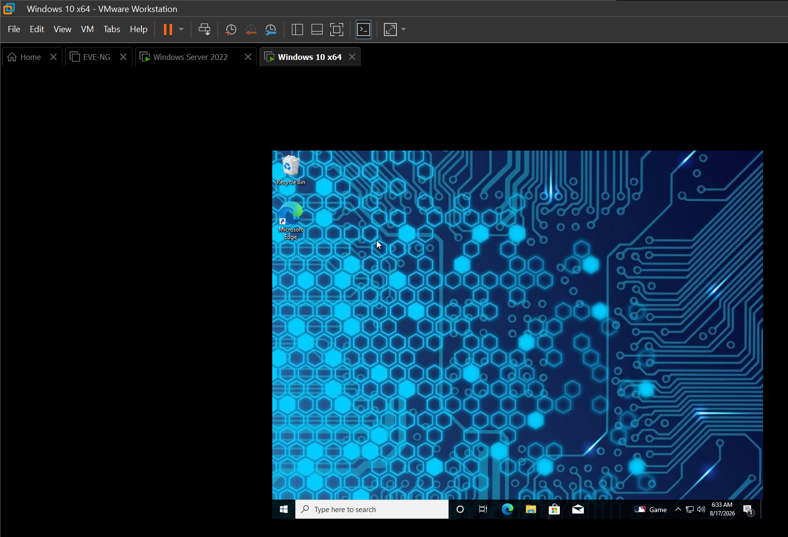

## 2. Windows Server 2022

The server hosts Active Directory, Group Policy Management, and the software distribution share.

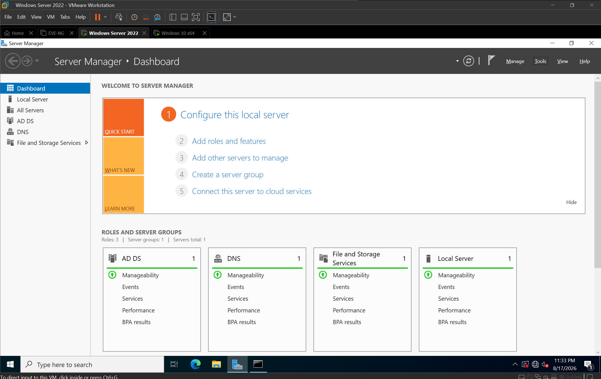

## 3. Prepare the software repository

The 7-Zip MSI was placed in the server's shared `Software` folder.

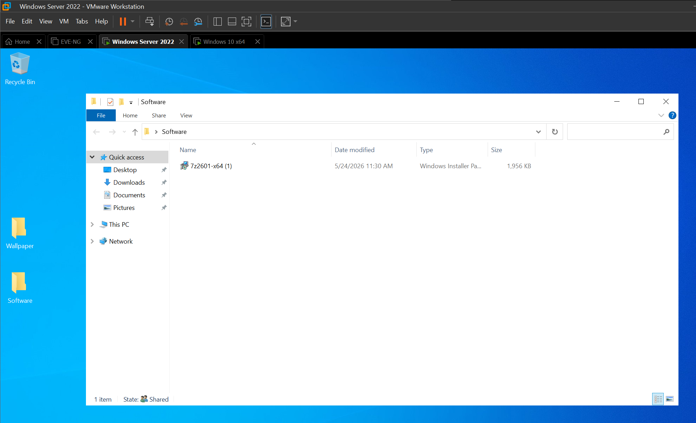

## 4. Share the software folder

The `Software` directory was exposed as an SMB share so clients could access installers through a UNC path.

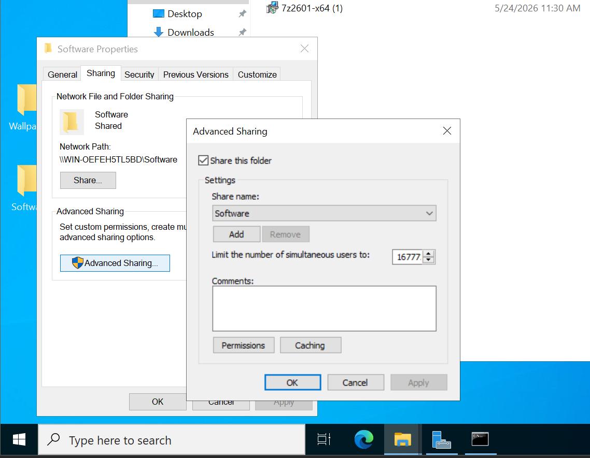

## 5. Review share permissions

Read access was configured for domain users/principals that need to retrieve software packages.

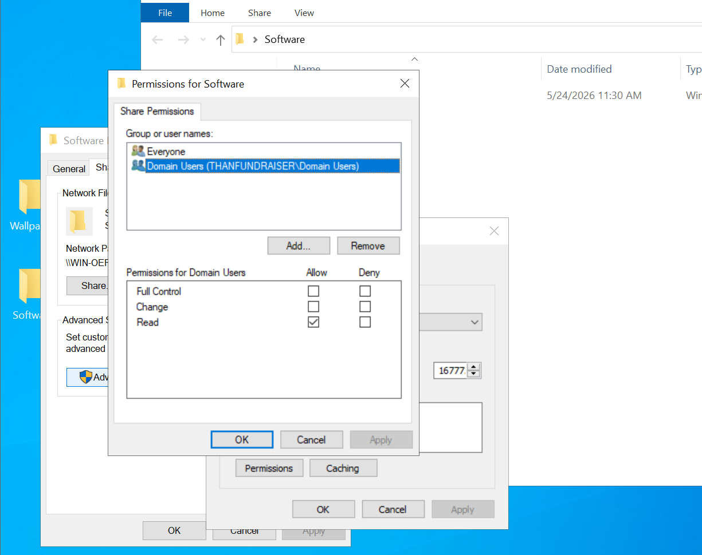

## 6. Add Domain Computers

Because the package is assigned under **Computer Configuration**, the domain computer security group was added to the deployment share permissions.

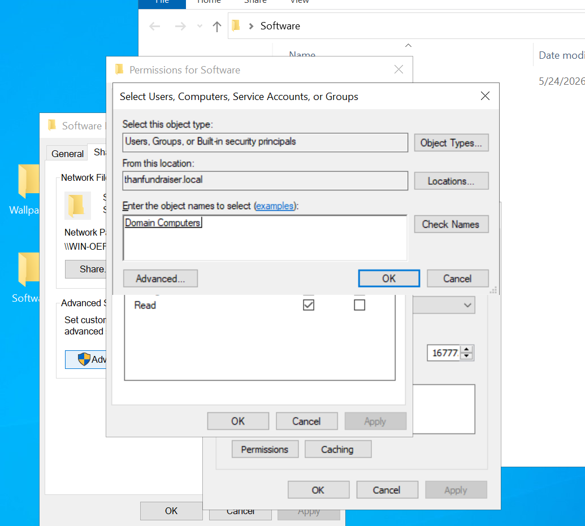

## 7. Confirm read permissions

The software share is intended for package retrieval, so domain computers receive read access rather than write access.

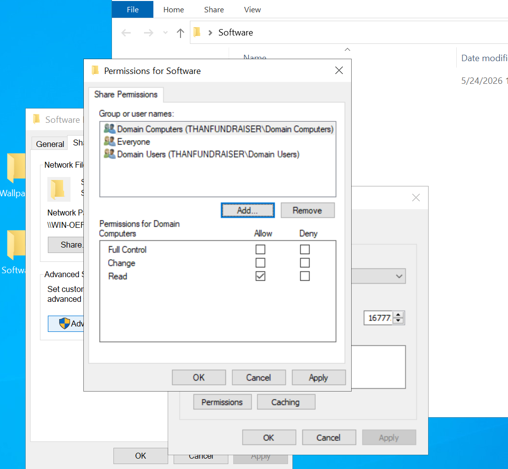

## 8. Test the UNC path from the client

The Windows 10 client successfully browsed the server share and could see the 7-Zip MSI.

```text
\\WIN-OEFEH5TL5BD\Software
```

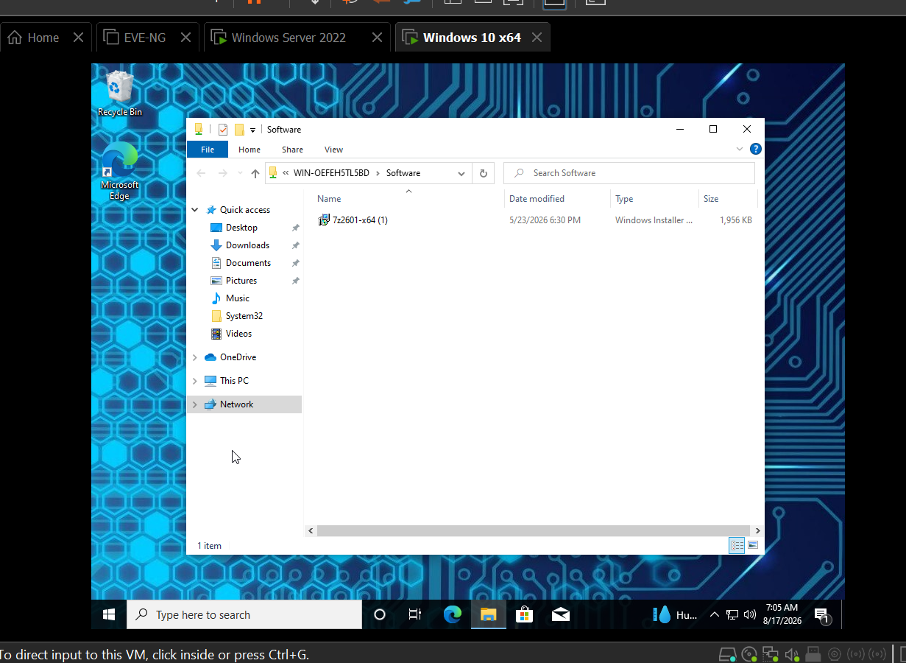

## 9. Target the ICT OU

The Windows 10 computer account is located in the `ICT` OU, which provides the scope for the deployment GPO.

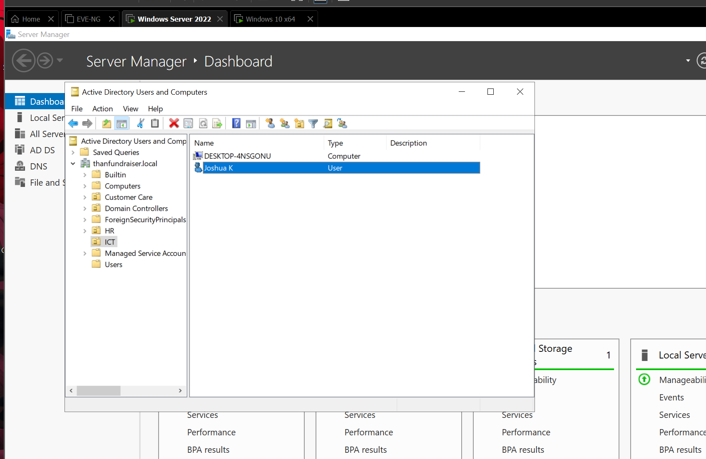

## 10. Use the Software ICT GPO

The `Software ICT` GPO is linked to the `ICT` OU and used for the software installation policy.

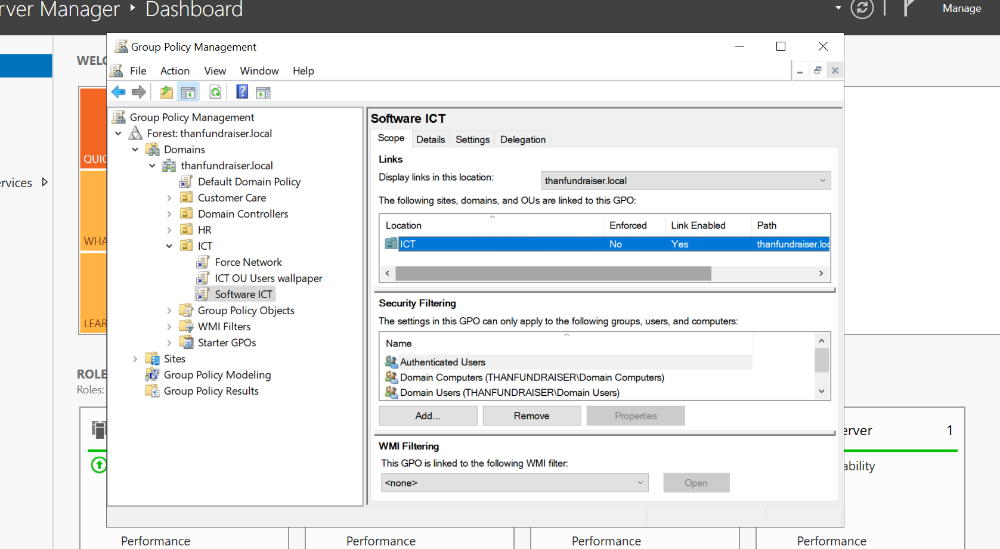

## 11. Assign the 7-Zip MSI

The MSI was added under:

```text
Computer Configuration
└── Policies
    └── Software Settings
        └── Software installation
```

The package source points to the server's UNC share and the deployment state is **Assigned**.


## 12. Refresh Group Policy

On the Windows 10 client:

```cmd
gpupdate /force
```

Windows detected a computer policy that must be processed during startup and prompted for a restart.

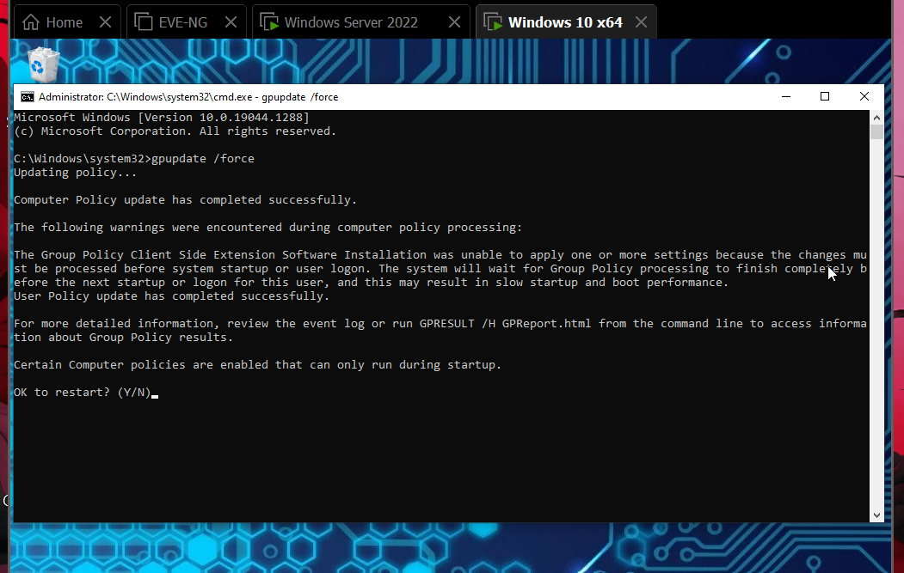

## 13. Verify automatic installation

After reboot, 7-Zip appeared in the Start menu without the MSI being manually launched on the client.


## 14. Launch test

7-Zip File Manager opened successfully, confirming the application was deployed and usable.

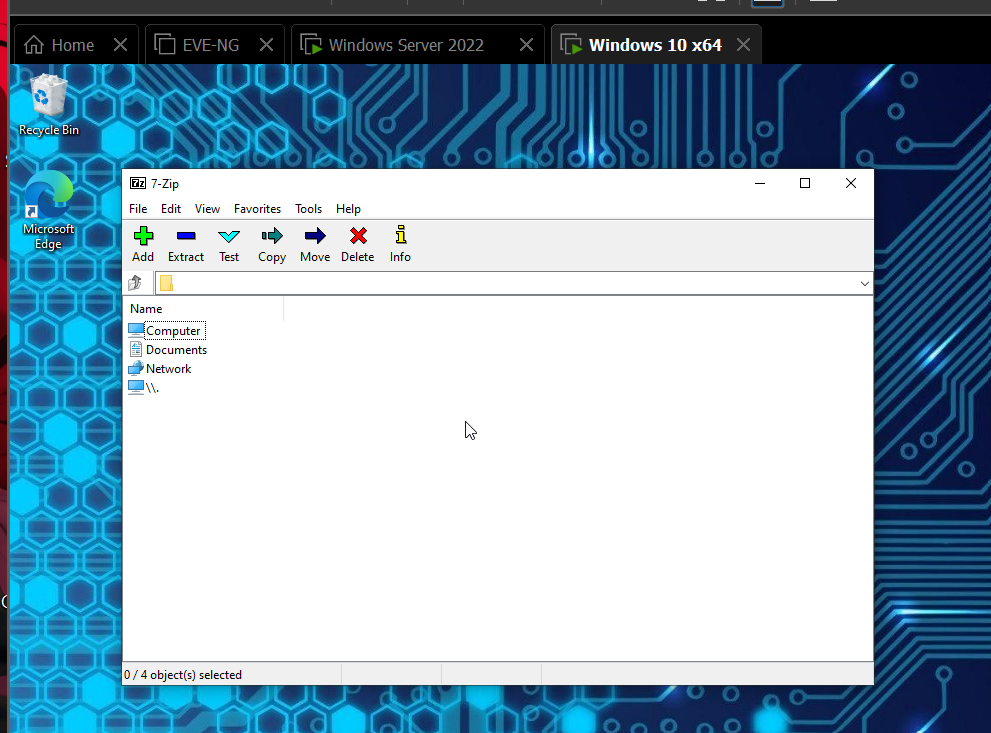

## Result

```text
7-Zip MSI -> Server Share -> Software ICT GPO -> Windows 10 Startup -> Installed
```

The native MSI deployment path was successful, providing a known-good baseline before moving to EXE repackaging.
